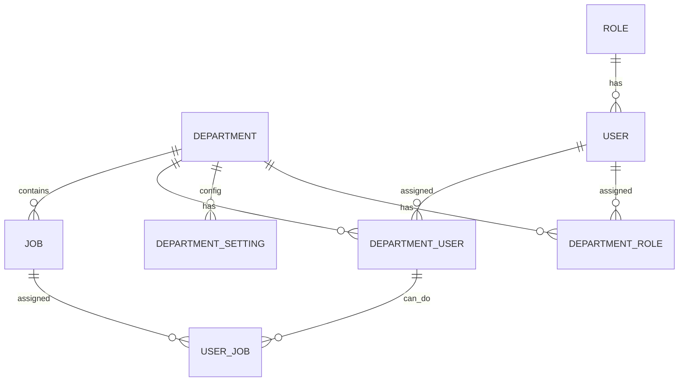

# ProcureFlow Departman & İş Yönetimi Geliştirme Yol Haritası

> Son güncelleme: 2026-04-16
> Mimari karar: Platform artık 4 scope üzerinde çalışır: **platform**, **partner**, **supplier**, **channel**.
> Bu yol haritası partner scope içindeki departman ve iş yönetimini kapsar.
> Channel scope için ayrı bir yol haritası açılacak: `CHANNEL_YOL_HARITASI.md`
> Ödeme altyapısı için: `ODEME_INFRA_YOL_HARITASI.md`

## 0. Mimari Bağlam (Özet)

Bu dosya partner.account_owner ve partner.org_admin tarafından yönetilen
departman, iş ve personel yapısını tanımlar.

Önemli kural değişiklikleri:
- Departman ve iş yönetimi artık sadece `partner` scope kullanıcılarına açıktır.
- `channel` kullanıcıları kendi organizasyon yapılarını bu ekrandan değil,
  kanal panelinden yönetir.
- `supplier` kullanıcıları kendi ekip yapısını supplier panelinden yönetir.
- Super admin tüm scope'lardaki departman yapılarını görebilir;
  yetki verdiği platform personeli de yönetebilir.

### Scope Başına Departman Yönetimi

| Scope    | Departman Yönetimi | Panel Yeri              |
|----------|-------------------|-------------------------|
| platform | hayır             | platform yönetimi       |
| partner  | evet              | bu dosya                |
| supplier | evet              | supplier paneli         |
| channel  | evet              | kanal paneli            |

## 1. Kapsamlı Kullanım ve Geliştirme Planı
    
- [x] **Departman Yönetimi**
    - [x] Departman ekle, düzenle, sil (aktif/pasif durumu ile arşivleme)
    - [x] Her departmanın adı, açıklaması ve sorumluluk alanı net olmalı
    - [x] Departmanlara özel ayarlar (satın alma kuralları, onay limitleri, tedarikçi listeleri)
    - [x] Departman içi roller (yönetici, satın almacı, onaycı vb.)
    - [x] Departmanlar arası işbirliği ve ortak süreçler (ör: onay zinciri)
    - [x] Departman bazlı raporlama (hacim, teklif, onay vb.)
    - [x] Departmanlar arası iş/görev transferi
    - [x] Departmanların aktif/pasif durumu (arşivleme)
- [ ] **İş/Görev Yönetimi**
    - [x] Her departmanın altında sınırsız iş/görev ekle, düzenle, sil
    - [x] İşler açıklama ve aktif/pasif durumu ile tutulur
    - [x] İşler departmanlar arası paylaşılabilir (işbirliği)
    - [x] İşler departman özelinde kurallara bağlanabilir
- [ ] **Personel Yönetimi ve Atama**
    - [x] Personel eklerken bir veya birden fazla departman seçimi
    - [x] Departman seçilince, o departmanın işleri listelenir
    - [x] Personelin hangi işleri yapacağı seçilebilir, kaldırılabilir
    - [x] Personel detayında departman ve iş/görev ilişkisi izlenebilir
- [ ] **Rol ve Yetkilendirme**
    - [x] Rol bazlı yetkiler: departman, iş, personel ekleme/silme/düzenleme
    - [x] Departman bazlı yetkilendirme: kullanıcı sadece kendi departmanını görebilir/yönetebilir
    - [x] Rol bazlı departman içi roller (yönetici, satın almacı, onaycı)
    - [x] Yetkisi olmayan işlemler arayüzde gizlenir
- [ ] **Raporlama ve Analiz**
    - [x] Departman bazlı raporlar (hacim, teklif, onay, iş yükü)
    - [x] İş bazlı performans ve süreç raporları
    - [x] Departmanlar arası işbirliği ve süreç analizleri

---

## 2. Adım Adım Geliştirme Planı

- [x] Temel Altyapı
    - [x] Departman veri modeli ve CRUD API’ları
    - [x] İş/görev veri modeli ve departman ilişkisi
    - [x] Personel veri modeli ve departman/iş ilişkisi
    - [x] Rol ve yetkilendirme veri modeli
- [x] Yönetim Arayüzleri
    - [x] Departman yönetim ekranı (ekle, düzenle, sil, aktif/pasif, açıklama, özel ayarlar)
    - [x] İş/görev yönetim ekranı (departman altında ekle, düzenle, sil)
    - [x] Personel yönetim ekranı (departman ve iş atama, kaldırma)
    - [x] Rol ve yetki yönetim ekranı (rol bazlı izinler, departman içi roller)
- [x] Gelişmiş Özellikler
    - [x] Departmanlar arası işbirliği ve iş/görev paylaşımı
    - [x] Departman bazlı raporlama ve analiz ekranları
    - [x] Departman özel ayarları ve kuralları
    - [x] Aktif/pasif departman ve iş/görev yönetimi (arşivleme)
    - [x] Departman içi roller ve iş akışı yönetimi
- [x] Güvenlik ve Yetkilendirme
    - [x] Kullanıcıya sadece yetkili olduğu departman/iş/görevlerin gösterilmesi
    - [x] Yetkisi olmayan işlemlerin arayüzde gizlenmesi

---

## 3. Örnek Veri Modeli (Entity Relationship) ✅



---

## 4. Örnek Arayüz Tasarımı

### Departman Yönetimi
- Departman listesi (ad, açıklama, aktif/pasif, özel ayarlar, işlemler)
- Departman detayında:
  - İş/görev listesi (ekle, düzenle, sil)
  - Personel listesi (ekle, çıkar, iş atama)
  - Departman içi roller ve yetkiler
  - Departman özel ayarları sekmesi

### Personel Yönetimi
- Personel listesi
- Personel detayında:
  - Bağlı olduğu departmanlar
  - Her departmanda atanmış işler
  - İş ekle/kaldır butonları
  - Rol ve yetki görüntüleme

### Rol ve Yetki Yönetimi
- Rol listesi
- Her rol için:
  - Departman ekleme/düzenleme/silme yetkisi
  - İş/görev ekleme/düzenleme/silme yetkisi
  - Personel ekleme/düzenleme/silme yetkisi
  - Departman içi rol atama

### Raporlama
- Departman bazlı iş yükü, teklif, onay, hacim raporları
- İş bazlı performans raporları
- Departmanlar arası işbirliği ve süreç analizleri

---

## 5. Detaylı Teknik Planlama

### Backend
- Python (FastAPI/Django) veya Node.js (Express/NestJS) ile RESTful API.
- Modeller: Department, Job, User, DepartmentUser, UserJob, Role, DepartmentRole, DepartmentSetting.
- Yetkilendirme: JWT/Session tabanlı, rol ve departman bazlı kontrol.
- Raporlama için aggregate sorgular.

### Frontend
- React (TypeScript) veya Vue.js.
- Ana sayfa: Departmanlar, Personeller, Roller, Raporlar sekmeleri.
- Departman detayında işler ve personel yönetimi.
- Yetki bazlı arayüz bileşenleri (gizle/göster).
- Modal/popup ile iş ve personel atama.

### Veritabanı
- PostgreSQL önerilir.
- İlişkisel yapı (örnek ER diyagramı yukarıda).
- Aktif/pasif ve arşiv alanları.

### Ekstra
- Departmanlar arası iş/görev transferi için özel API.
- Departman özel ayarları için JSONField veya ayrı tablo.
- Departman içi roller için enum veya ayrı tablo.

---

## 6. Özet Akış

1. [x] **Departman oluştur** → Açıklama, özel ayar, aktif/pasif.
2. [x] **Departmana iş/görev ekle** → Açıklama, aktif/pasif.
3. [x] **Personel ekle** → Departman seç, iş/görev ata.
4. [x] **Rol ata** → Yetkileri belirle.
5. [x] **Departman içi roller ve iş akışı tanımla**.
6. [x] **Departmanlar arası işbirliği ve onay zinciri oluştur**.
7. [x] **Raporlama ve analiz ekranlarını kullan**.

---

## 7. Örnek API Endpointleri ✅

- `GET /departments` — Departmanları listele
- `POST /departments` — Departman oluştur
- `PUT /departments/{id}` — Departman güncelle
- `DELETE /departments/{id}` — Departman sil
- `GET /departments/{id}/jobs` — Departman işleri
- `POST /departments/{id}/jobs` — Departmana iş ekle
- `PUT /jobs/{id}` — İş güncelle
- `DELETE /jobs/{id}` — İş sil
- `GET /users` — Personel listesi
- `POST /users` — Personel ekle
- `PUT /users/{id}` — Personel güncelle
- `DELETE /users/{id}` — Personel sil
- `POST /users/{id}/assign-job` — Personele iş ata
- `DELETE /users/{id}/remove-job/{jobId}` — Personele iş kaldır
- `GET /roles` — Rol listesi
- `POST /roles` — Rol oluştur
- `PUT /roles/{id}` — Rol güncelle
- `DELETE /roles/{id}` — Rol sil
- `POST /roles/{id}/assign-user` — Role kullanıcı ata

---

## 8. Örnek Tablo Şemaları (SQL) ✅

```sql
CREATE TABLE department (
    id SERIAL PRIMARY KEY,
    name VARCHAR(100) NOT NULL,
    description TEXT,
    is_active BOOLEAN DEFAULT TRUE,
    settings JSONB
);

CREATE TABLE job (
    id SERIAL PRIMARY KEY,
    department_id INTEGER REFERENCES department(id),
    name VARCHAR(100) NOT NULL,
    description TEXT,
    is_active BOOLEAN DEFAULT TRUE
);

CREATE TABLE "user" (
    id SERIAL PRIMARY KEY,
    name VARCHAR(100) NOT NULL,
    email VARCHAR(100) UNIQUE NOT NULL
);

CREATE TABLE department_user (
    id SERIAL PRIMARY KEY,
    department_id INTEGER REFERENCES department(id),
    user_id INTEGER REFERENCES "user"(id)
);

CREATE TABLE user_job (
    id SERIAL PRIMARY KEY,
    department_user_id INTEGER REFERENCES department_user(id),
    job_id INTEGER REFERENCES job(id)
);

CREATE TABLE role (
    id SERIAL PRIMARY KEY,
    name VARCHAR(50) NOT NULL
);

CREATE TABLE department_role (
    id SERIAL PRIMARY KEY,
    department_id INTEGER REFERENCES department(id),
    user_id INTEGER REFERENCES "user"(id),
    role_id INTEGER REFERENCES role(id)
);
```

---

## 9. Örnek React Component Yapısı ✅

- `DepartmentList.tsx` — Departmanları listeler, ekle/düzenle/sil işlemleri
- `DepartmentDetail.tsx` — Departman detay, iş/görev ve personel yönetimi
- `JobList.tsx` — Departman altındaki işleri listeler
- `UserList.tsx` — Personel listesi ve detayları
- `RoleManagement.tsx` — Rol ve yetki yönetimi
- `AssignmentModal.tsx` — İş ve personel atama popup/modal

---

> **Not:** Bu dosya, geliştirme sürecinde yapılacak işlerin ve ilerlemenin takibi için kullanılacaktır. Her adım tamamlandıkça işaretlenecektir.
