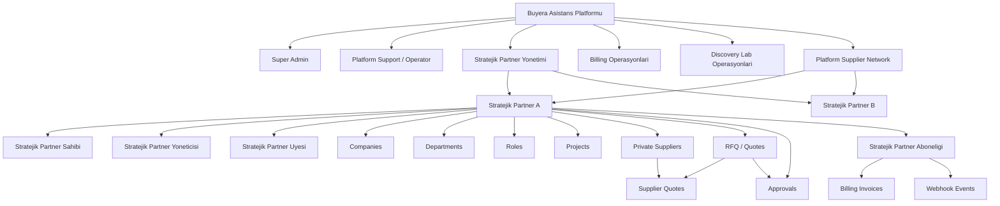
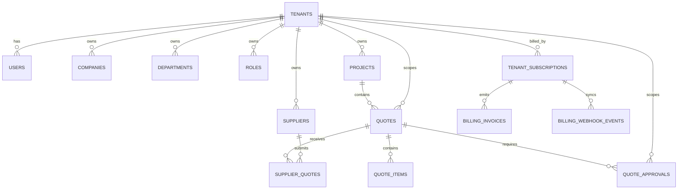
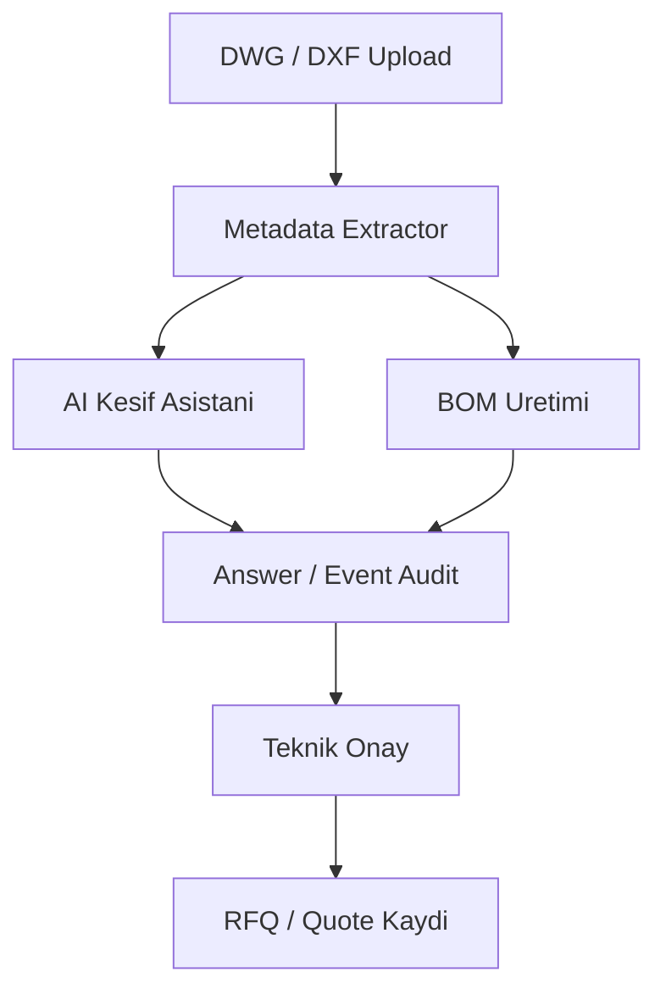

# Stratejik Partner SaaS Sistem Semasi

Bu dokuman, ProcureFlow icin kurulan cok kiracili satin alma yapisinin ana parcalarini ve calisma akisini gosterir.

## 1) Platform ve Stratejik Partner Mimari Semasi



## 2) Domain Veri Semasi



## 3) Uygulama Akisi

```mermaid
flowchart LR
    U[Kullanici] --> ROOT[/http://localhost:5175/]
    ROOT --> CHECK{Oturum var mi?}
    CHECK -- Hayir --> LOGIN[Login Page]
    CHECK -- Evet --> ROLE{System role / izin}

    ROLE -- Super Admin / Stratejik Partner Yonetimi / Platform Staff --> ADMIN[/admin]
    ROLE -- Procurement / Personel --> DASH[/dashboard]
    ROLE -- Supplier Session --> SUPPLIER[/supplier/dashboard]

    ADMIN --> TAB1[Platform Overview]
    ADMIN --> TAB2[Platform Operasyonlari]
    ADMIN --> TAB3[Discovery Lab Operasyonlari]
    ADMIN --> TAB4[Onboarding Studio]
    ADMIN --> TAB5[Stratejik Partner Yonetimi]
    ADMIN --> TAB6[Paket ve Kullanim / Billing]

    DASH --> RFQ[RFQ / Teklif Akislari]
    DASH --> REPORTS[Raporlar]
```

## 4) Discovery Lab ve Satin Alma Entegrasyonu


